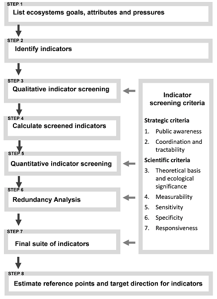

```{r, include = FALSE}
knitr::opts_chunk$set(
  collapse = TRUE,
  comment = "#>"
)
```

```{r setup}
library(indicators)
```
```{r, echo = F}
path <- file.path("C:/Users/DEMPSEYD/Documents/github/indicators/R")
load(paste(path, "/sysdata.rda", sep = ""))

n.show <- 4
n.digits <- 2
```

# Motivation
A comprehensive evaluation and selection of robust ecological indicators is one of the key steps in the process of implementing an Ecosystem Approach to fisheries management and to track progress towards meeting ecosystem goals. The "Guidance framework for the selection and evaluation of ecological indicators" (Bundy, Gomez, and Cook, 2017) developed an Indicator Selection Guidance Framework (Fig. 1) to select and evaluate potential indicators for ecosystem monitoring and assessment at different spatial scales using established selection criteria. 



The framework was successfully tested for the Scotian Shelf Biogregion. Four ecosystem attributes and one pressure were defined in Step 1: Biodiversity, Ecosystem Structure and Functioning, Ecosystem Stability and Resistance to Perturbations, Resource Potential, and Fishing Pressure. In Step 2, over 100 indicators were selected to represent these attributes and pressure. The qualitative screening in Step 3 reduced this set to 68 indicators (Table 1), and the quantitative screening and redundancy analysis in Steps 5 and 6 resulted in a final suite of 30 non-redundant ecological and fishing pressure indicators derived from fisheries independent and dependent data (Table 1). For more information, including attribute and sub-attribute definitions and the methods used to select the final suite of indicators, please refer to the guidance framework document (Bundy, Gomez, and Cook, 2017).

The `indicators` package provides functions to calculate the suite of marine ecosystem indicators screened in Step 4 of the guidance framework (Table 1; Bundy, Gomez, and Cook, 2017). Some functions may be used to calculate additional indicators, for example by specifying different species groups or using alternative values for arguments with default values.


Table 1: `indicators` function to calculate each of the 68 indicators screened for the Scotian Shelf in Step 4 of the Guidance Framework. Ecosystem attributes and pressure are shown in **BOLD CAPS**. Indicators included in the final suite for the Scotian Shelf are highlighted in **bold**.

  | **SUB-ATTRIBUTE** | **INDICATOR** | **FUNCTION** |
  |:-----------------------|:------------------------|:---------------:|
  | **BIODIVERSITY** |  | |
  | Species Richness | **Margalef's Species Richness** | `margalef()` |
  | Species Richness | Margalef's Species Richness (groundfish) | `margalef()` |
  | Species Richness | Species Richness | `speciesRichness()` |
  | Species Diversity | Shannon's Diversity Index | `shannon()` |
  | Species Diversity | Hill's Diversity Index | `hillN1()` |
  | Species Diversity | Kempton's Q | `kemptonQ()` |
  | Species Evenness | Pielou's Species Evenness | `pielouEvenness()` |
  | Species Evenness | Hill's Dominance | `hillN2()` |
  | Species Evenness | **Heip's Evenness Index** | `heips()` |
  | **STRUCTURE & FUNCTIONING** |  | |
  | Structure: Top of Food Web | **Large Fish Indicator** | `largeFishIndicator()` |
  | Structure: Top of Food Web | Large Species Indicator | `largeSpeciesIndicator()` |
  | Structure: Top of Food Web | Proportion of Predatory Fish | `biomassRatio()` |
  | Structure: Trophic Guilds | Biomass of Large Benthivores | `resourcePotential` |
  | Structure: Trophic Guilds | Biomass of Medium Benthivores | `resourcePotential` |
  | Structure: Trophic Guilds | Biomass of Planktivores | `resourcePotential` |
  | Structure: Trophic Guilds | **Biomass of Piscivores** | `resourcePotential` |
  | Structure: Trophic Guilds | **Biomass of Zoopiscivores** | `resourcePotential` |
  | Size structure: Fish Community | **Mean Length (weighted by abundance)** | `meanLengthCommunity()` |
  | Size structure: Fish Community | Mean Length (weighted by biomass) | `meanLengthCommunity()` |
  | Trophic Structure | **Mean Trophic Level of Community** | `meanTLCommunity()` |
  | Structural Change | Pelagic to Demersal biomass ratio | `biomassRatio()` | 
  | Structural Change | Invertebrate to Demersal biomass ratio | `biomassRatio()` | 
  | Ecosystem Functioning | **Community Condition** | `communityCondition()` |
  | Ecosystem Functioning | **Large Benthivore Condition** | `communityCondition()` |
  | Ecosystem Functioning | **Medium Benthivore Condition**  | `communityCondition()` |
  | Ecosystem Functioning | Planktivore Condition | `communityCondition()` |
  | Ecosystem Functioning | **Piscivore Condition** | `communityCondition()` |
  | Ecosystem Functioning | **Zoopiscivore Condition** | `communityCondition()` |
  | **STABILITY & RESISTANCE** |  | |
  | Ecosystem Resistance | **Mean Lifespan** | `meanMaxAge()` |
  | Ecosystem Resistance | Mean Max Length (weighted by abundance) | `meanMaxLength()` |
  | Ecosystem Resistance | Mean Max Length (weighted by biomass) | `meanMaxLength()` |
  | Ecosystem Resistance | **Intrinsic Vulnerability Index of Landings** | `IVILandings()` |
  | Stability of Trophic Community | **Biomass per Trophic Level 2** | `biomassPerTL()` |
  | Stability of Trophic Community | Biomass per Trophic Level 3 | `biomassPerTL()` |
  | Stability of Trophic Community | Biomass per Trophic Level 4 | `biomassPerTL()` |
  | Stability of Community Biomass | **Coefficient of Variation of Biomass** | `CVBiomass()` |
  | **RESOURCE POTENTIAL** | | |
  | Potential of Community | **Biomass** | `resourcePotential()` |
  | Potential of Community | Biomass of Finfish | `resourcePotential()` |
  | Potential of Community | **Biomass of Invertebrates** | `resourcePotential()` |
  | Potential of Fished Groups | Biomass of Clupeids | `resourcePotential()` |
  | Potential of Fished Groups | Biomass of Forage Fish | `resourcePotential()` |
  | Potential of Fished Groups | **Biomass of Gadoids** | `resourcePotential()` |
  | Potential of Fished Groups | Biomass of Groundfish | `resourcePotential()` |
  | Potential of Fished Groups | **Biomass of Flatfish** | `resourcePotential()` |
  | Potential of Indicator Species | **Biomass of Skates** | `resourcePotential()` |
  | Fishing Strategies & System Productivity | Fishing in Balance | `fishingInBalance()` |
  | **FISHING PRESSURE** |  | |
  | Fishing Pressure on Community | **Fishing Pressure on Community** | `fishingPressure()` |
  | Fishing Pressure on Community | Fishing Pressure on Finfish | `fishingPressure()` |
  | Fishing Pressure on Community | Fishing Pressure on Invertebrates | `fishingPressure()` |
  | Fishing Pressure on Fished Groups | **Fishing Pressure on Clupeids** | `fishingPressure()` |
  | Fishing Pressure on Fished Groups | Fishing Pressure on Forage Fish | `fishingPressure()` |
  | Fishing Pressure on Fished Groups | Fishing Pressure on Groundfish | `fishingPressure()` |
  | Fishing Pressure on Fished Groups | Fishing Pressure on Gadoids | `fishingPressure()` |
  | Fishing Pressure on Fished Groups | Fishing Pressure on Skates | `fishingPressure()` |
  | Fishing Pressure on Fished Groups | Fishing Pressure on Flatfish | `fishingPressure()` |
  | Distribution of Fishing Pressure | **Marine Trophic Index** | `meanTLLandings()` |
  | Distribution of Fishing Pressure | **Mean Trophic Level of Landings**  | `meanTLLandings()`|
  | Distribution of Fishing Pressure | **Diversity of Target Species** | `speciesRichness()` |
  | Total Landings | **Landings** | `landings()` |
  | Total Landings | Landings of Clupeids | `landings()` |
  | Total Landings | Landings of Forage Fish | `landings()` |
  | Total Landings | Landings of Groundfish | `landings()` |
  | Total Landings | Landings of Gadoids | `landings()` |
  | Total Landings | Landings of Finfish | `landings()` |
  | Total Landings | Landings of Invertebrates | `landings()` |
  | Total Landings | **Landings of Skates** | `landings()` |
  | Total Landings | **Landings of Flatfish** | `landings()` |
  | Total Landings | **Landings of Large Pelagics** | `landings()` |

# Data Requirements
This section describes the data required to calculate all of the indicators in Table 1. If some data are unavailable, a subset of indicators will be calculated.

## Fishery-independent data
**X** is a dataframe of fishery independent survey data with columns `YEAR`, `ID`, `SPECIES`, and `ABUNDANCE` and/or `BIOMASS` (depending on which indicator is being calculated). `YEAR` indicates the year the observation was recorded, `ID` is an area code indicating where the observation was recorded, `SPECIES` is a numeric code indicating the species sampled, and `ABUNDANCE`/`BIOMASS` is the corresponding abundance/biomass (stratified and corrected for catchability as required).

```{r, echo = FALSE}
X1 <- X[X$YEAR == 2014 & X$ID == "AREA1", ]
X1 <- X1[1:n.show,]

X2 <- X[X$YEAR == 2014 & X$ID == "AREA2", ]
X2 <- X2[1:n.show, ]

X3 <- X[X$YEAR == 2015 & X$ID == "AREA1", ]
X3 <- X3[1:n.show, ]

X4 <- X[X$YEAR == 2015 & X$ID == "AREA2", ]
X4 <- X4[1:n.show, ]

X_show <- rbind(X1, X2 ,X3, X4)

X_show$BIOMASS <- formatC(X_show$BIOMASS, format = "e", digits = n.digits)
X_show$ABUNDANCE <- formatC(X_show$ABUNDANCE, format = "e", digits = n.digits)

X_show
```
Indicators calculated using `X` (among other arguments): Heip's Evenness Index, Hill's N1, Hills' N2, Kempton's Q, Margalef's Species Richness, Pielou's Species Evenness, Shannon's Diversity Index, Biomass ratio(s), Abundance/Biomass of species groups, Large Species Indicator, Mean Trophic Level of the Community, CV of Biomass, Mean Maximum Lifespan, Mean Maximum Length, and Fishing Pressure.


**X_length** is a dataframe of fishery independent survey data with columns `YEAR`, `ID`, `SPECIES`, `LENGTH`, and `ABUNDANCE` and/or `BIOMASS` (depending on which indicator is being calculated). As with `X`, `YEAR` indicates the year the observation was recorded, `ID` is an area code indicating where the observation was recorded, and `SPECIES` is a numeric code indicating the species sampled. `LENGTH` is the length class (cm) and `ABUNDANCE`/`BIOMASS` is the corresponding abundance/biomass at length (stratified and corrected for catchability as required). Species for which there are no length data should be assigned `LENGTH` = -99. These observations are removed by the function(s).

```{r, echo = FALSE}
X_length <- X_length[-which(X_length$LENGTH == -99), ]

X1_length <- X_length[X_length$YEAR == 2014 & X_length$ID == "AREA1", ]
X1_length <- X1_length[1:n.show,]

X2_length <- X_length[X_length$YEAR == 2014 & X_length$ID == "AREA2", ]
X2_length <- X2_length[1:n.show, ]

X3_length <- X_length[X_length$YEAR == 2015 & X_length$ID == "AREA1", ]
X3_length <- X3_length[1:n.show, ]

X4_length <- X_length[X_length$YEAR == 2015 & X_length$ID == "AREA2", ]
X4_length <- X4_length[1:n.show, ]

X_length_show <- rbind(X1_length, X2_length ,X3_length, X4_length)

X_length_show$BIOMASS <- formatC(X_length_show$BIOMASS, format = "e", digits = n.digits)
X_length_show$ABUNDANCE <- formatC(X_length_show$ABUNDANCE, format = "e", digits = n.digits)
X_length_show
```

Indicators calculated using `X_length` (among other arguments): Community Condition, Large Fish Indicator, Mean Length.

## Fishery-dependent data
**land** is a dataframe of fishery dependent (commercial) landings data with columns `YEAR`, `ID`, `SPECIES` and `CATCH`. `YEAR` indicates the year the landing was recorded, `ID` is an area code indicating where the landing was recorded, `SPECIES` is a numeric code indicating the species landed, and `CATCH` is the corresponding landed weight, in the same units as `BIOMASS` in `X` and `X_length`.

The species codes in `land` can be consistent with those in `X` and `X_length` or specific to commercial landings; however, they must be consistent with the additional information described below (see Species Information and Species Groups).

```{r, echo = FALSE}
land <- land[order(land$YEAR),]

land1 <- land[land$YEAR == 2014 & land$ID == "AREA1", ]
land1 <- land1[1:n.show,]

land2 <- land[land$YEAR == 2014 & land$ID == "AREA2", ]
land2 <- land2[1:n.show, ]

land3 <- land[land$YEAR == 2015 & land$ID == "AREA1", ]
land3 <- land3[1:n.show, ]

land4 <- land[land$YEAR == 2015 & land$ID == "AREA2", ]
land4 <- land4[1:n.show, ]

land_show <- rbind(land1, land2 ,land3, land4)

land_show$CATCH <- formatC(land_show$CATCH, format = "e", digits = n.digits)
land_show
```
Indicators calculated using `land` (among other arguments): Intrinsic Vulnerability Index, Fishing-in-Balance, Diversity of the Target Species, Fishing Pressure, Landings, Marine Trophic Index, and Mean Trophic Index of Landings.

## Additional Information 

### Species Information
Additional information on key species (i.e., all species for which the information is available) is required to calculate several indicators (Table 2). 

Table 2: Additional species information required to calculate given indicators. TABLE HEADER is the required name of the column containing the information in the table passed to the function.

| **SPECIES INFO** | **TABLE HEADER** |**DESCRIPTION** | **INDICATOR(S)** 
|:------------| :------------:|:--------------------------------|:----------------|
| Trophic Level | `TL` | Trophic level of species caught in fisheries-independent surveys | Kempton's Q[^1], Mean Trophic Level of Community, Biomass per Trophic Level | 
| Maximum Length | `MAXLENGTH` | Maximum recorded length of of species caught in fisheries-independent surveys | Large Species Indicator, Mean Maximum Length |
| Maximum Age | `MAXAGE` | Maximum recorded age of of species caught in fisheries-independent surveys | Maximum Lifespan |
| Intrinsic Vulnerability Index | `IVI` | Vulnerability of commercial species, determined by considering several traits (e.g. max length, age at first maturity, longevity, von Bertalanffy growth parameter, natural mortality, fecundity, spatial behaviour, and geographic range) | IVI of landings | 
| Trophic Level of Landed Species | `TL_LAND` | Trophic level of commercial species | Fishing-in-Balance, Marine Trophic Index, Mean Trophic Level of Landings |

[^1]: Trophic level is only required to calculate Kempton's Q if a threshold trophic level is specified (e.g., `minTL` > 0).
  
  
The species information is passed to the function through a table with at least two columns: `SPECIES` (the species codes) and the corresponding column of information, which should be named after one of the table headers in Table 2. For example:

```{r, echo = FALSE}
TL.table <- na.omit(species.info[, c("SPECIES", "TL")])
TL.table$TL <- round(TL.table$TL, digits = 3)
TL.table <- TL.table[1:(n.show*2), ]
TL.table
```

If the species codes used in `X` and `land` are the same, it may be convenient to store all of the extra information in a single table. If information is not available for a given species, assign a value of `NA`. This whole table may be passed to a function; superfluous columns will be ignored.

```{r, echo = FALSE}
species.info_show <- species.info[1:10, ]
species.info_show$TL <- round(species.info_show$TL, digits = 3)
species.info_show$TL_LAND <- round(species.info_show$TL_LAND, digits = 3)
species.info_show
```
If the species codes in `X` and `land` are not the same, then the extra information should be stored in at least two tables (e.g., `TL`, `MAXLENGTH`, and `MAXAGE` in one table, and `IVI` and `TL_LAND` in the other).

### Length-Weight data
The Community Condition indicator (based on Fulton's condition index) requires annual length-weight data for all species of interest. This table should have 5 columns: `YEAR`, `ID`, and `SPECIES` correspond with those columns in `X_length`, while `LENGTH` is fish length at the corresponding `WEIGHT` (fish weight).

```{r, echo = FALSE}
Length_Weight1 <- Length_Weight[Length_Weight$YEAR == 2014 & Length_Weight$ID == "AREA1", ]
Length_Weight1 <- Length_Weight1[1:n.show,]

Length_Weight2 <- Length_Weight[Length_Weight$YEAR == 2014 & Length_Weight$ID == "AREA2", ]
Length_Weight2 <- Length_Weight2[1:n.show, ]

Length_Weight3 <- Length_Weight[Length_Weight$YEAR == 2015 & Length_Weight$ID == "AREA1", ]
Length_Weight3 <- Length_Weight3[1:n.show, ]

Length_Weight4 <- Length_Weight[Length_Weight$YEAR == 2015 & Length_Weight$ID == "AREA2", ]
Length_Weight4 <- Length_Weight4[1:n.show, ]

Length_Weight_show <- rbind(Length_Weight1, Length_Weight2 ,Length_Weight3, Length_Weight4)

#len.wt_show <- Length_Weight[1:(n.show*2), ]


Length_Weight_show
```

### Species Groups
Several functions give the user the option to choose the species group(s) for which to calculate the indicator. The groups are defined by the user in a table, called here species.groups. The column names of species.groups are the groups of interest, and the entries in each column are the codes for species that belong in that group. Both fisheries-independent groups (e.g., trophic guilds) and commercial groups can be included in this table, but take care to be consistent with the species codes (e.g., if there are different species codes in X and `land`, the fisheries-independent groups should include species codes from `X`, and the commercial groups should include species codes from `land`).

```{r, echo = FALSE}
species.groups_show <- species.groups[1:(n.show*2), c(1:7)]

species.groups_show
```
Note that the user does not need to include a column with all species (i.e., all species are automatically included in the calculation if argument `group = "ALL"`).

# Application
**If biomass of species X was not captured in the survey, species X is still likely to be present, just not detected or perhaps not recorded. Replacing with zero would have an impact on trends, whereas treating as NA does not.**

This section describes the general use of the functions in the indicators package. See the package manual or help file for each function for more details.

Most functions calculate a single indicator, and return a dataframe with three columns: `ID`, `YEAR`, and the indicator. For example, the following function call calculates Shannon's index of diversity for two areas (defined by column `ID` in `X`) from 2010 - 2015:

```{r, eval = FALSE}
shannon(X, group = "ALL", metric = "ABUNDANCE", species.table = NULL,  years = c(2014:2019))
```
```{r, echo = FALSE}
shan_out <- shannon(X, group = "ALL", metric = "ABUNDANCE", species.table = NULL,  years = c(2014:2019))
shan_out$ShannonDiversity <- round(shan_out$ShannonDiversity, digits = 3) 
shan_out
```

`biomassPerTL()` returns `ID` and `YEAR`, plus a column for each trophic level range specified by `TL.grouping` (see `?biomassPerTL` for more detail):

```{r, eval = FALSE}
biomassPerTL(X, TL.table = species.info, metric = "BIOMASS", TL.grouping = 1, years = c(2014:2019))
```
```{r, echo = FALSE}
bio_TL <- biomassPerTL(X, TL.table = species.info, metric = "BIOMASS", TL.grouping = 1, years = c(2014:2019))
bio_TL 
```

Some functions can calculate more than one indicator depending on the arguments. For example, meanTLLandings() calculates the mean trophic level of the landings when the trophic level minTL = 0, and the mean trophic index when trophic level minTL > 0.

```{r, eval = FALSE}
meanTLLandings(land, TL.table = species.info, minTL = 0, years = c(2014:2019))
```
```{r, echo = FALSE}
TLL <- meanTLLandings(land, TL.table = species.info, minTL = 0, years = c(2014:2019))
TLL$MeanTL.Landings <- round(TLL$MeanTL.Landings, digits = 3)
TLL
```

```{r, eval = FALSE}
meanTLLandings(land, TL.table = species.info, minTL = 3.25, years = c(2014:2019))
```
```{r, echo = FALSE}
MTI <- meanTLLandings(land, TL.table = species.info, minTL = 3.25, years = c(2014:2019))
MTI$MTI.Landings_3.25 <- round(MTI$MTI.Landings_3.25, digits = 3)
MTI
```
Several functions (e.g., `resourcePotential()`, `biomassRatio()`, `communityCondition()`, `landings()`, and `fishingPressure()`) can return the indicator values for multiple species groups defined in `species.groups` with one function call. For example, the following function call calculates the biomass of: all species in the community, clupeids, finfish, and flatfish for two areas from 2014 - 2019.

```{r, eval = FALSE}
resource.groups <- c("ALL", "CLUPEIDS", "FINFISH", "FLATFISH")

resourcePotential(X, metric = "BIOMASS", groups = resource.groups, species.table =   
                    species.groups, years = c(2014:2019))
```
```{r, echo = FALSE}
resource.groups <- c("ALL", "CLUPEIDS", "FINFISH", "FLATFISH")

potential <-resourcePotential(X, metric = "BIOMASS", groups = resource.groups, species.table = species.groups, years = c(2014:2019))
potential
```

Finally, all indicators from a given attribute or pressure can be calculated with a single function call. If some data are not available, a subset of indicators can be returned. For example, the following call would return 18 structure and functioning indicators (not shown here):

```{r}
ratio.groups <- data.frame(rbind(c("PELAGIC", "GROUNDFISH"), c("PREDATORS", "ALL")))
names(ratio.groups) <- c("group1", "group2")
trophicguild.groups <- c("LBENTHIVORE", "MBENTHIVORE", "PISCIVORE", "PLANKTIVORE", "ZOOPISCIVORE")
condition.groups <- c("ALL", "FINFISH", "LBENTHIVORE", "MBENTHIVORE", "PISCIVORE", "PLANKTIVORE", "ZOOPISCIVORE")

inds <- allStructure(X = X, X_length = X_length, 
             LSI.group = "ALL", LFI.group = "ALL",
             resource.groups = trophicguild.groups, condition.groups = condition.groups,
             ratio.groups = ratio.groups,
             species.table = species.groups, speciesinfo.table = species.info,
             LenWt.table = Length_Weight,
             lmax = 85, years = c(2014:2019))
names(inds)
```

# References 
Bundy A, Gomez C, Cook AM. 2017. Guidance framework for the selection and evaluation of ecological indicators. Can. Tech. Rep. Fish. Aquat. Sci. 3232: xii + 212 p.


