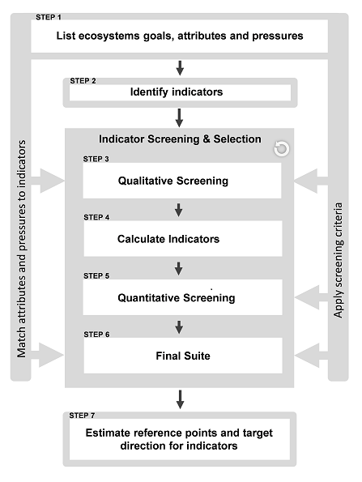

```{r, include = FALSE}
knitr::opts_chunk$set(
  collapse = TRUE,
  comment = "#>"
)
```

```{r setup, echo = FALSE}
library(marindicators)

n.show <- 4
n.digits <- 2
```

# Motivation
A comprehensive evaluation and selection of robust ecological indicators is one of the key steps in the process of implementing an Ecosystem Approach to fisheries management and to track progress towards meeting ecosystem goals. The "Guidance framework for the selection and evaluation of ecological indicators" (Bundy, Gomez, and Cook, 2017) was developed to select and evaluate potential indicators for ecosystem monitoring and assessment at different spatial scales using established selection criteria (Fig. 1). 



The framework was successfully tested for the Scotian Shelf Biogregion, Canada. In Step 1, four ecosystem attributes and one pressure were defined: Biodiversity, Ecosystem Structure and Functioning, Ecosystem Stability and Resistance to Perturbations, Resource Potential, and Fishing Pressure. In Step 2, 186 indicators were selected to represent these attributes and pressure. The qualitative screening in Step 3 reduced this set to 68 indicators, which were calculated in Step 4 (Table 1). The quantitative screening in Step 5 resulted in a final suite of 30 non-redundant ecological and fishing pressure indicators derived from fishery independent and dependent data (Table 1; Step 6). For more information, including attribute and sub-attribute definitions and the methods used to select the final suite of indicators, please refer to the Guidance Framework document (Bundy, Gomez, and Cook, 2017).

The `marindicators` package provides functions to calculate the suite of marine ecosystem indicators calculated in Step 4 of the Guidance Framework (Table 1; Bundy, Gomez, and Cook, 2017). Some functions may be used to calculate additional indicators, for example by specifying different species groups or using alternative values for arguments with default values.


Table 1: `marindicators` function to calculate each of the 68 indicators calculated for the Scotian Shelf Bioregion in Step 4 of the Guidance Framework. Ecosystem attributes/pressure are shown in **BOLD CAPS**. Indicators included in the final suite for the Scotian Shelf Bioregion are highlighted in **bold**.

  | **SUB-ATTRIBUTE** | **INDICATOR** | **FUNCTION** |
  |:-----------------------|:-------------------------|:---------------:|
  | **BIODIVERSITY** |  | `allBiodiversity()` |
  | Species Richness | **Margalef's Species Richness** | `margalef()` |
  | Species Richness | Margalef's Species Richness (groundfish) | `margalef()` |
  | Species Richness | Species Richness | `speciesRichness()` |
  | Species Diversity | Shannon's Diversity Index | `shannon()` |
  | Species Diversity | Hill's Diversity Index | `hillN1()` |
  | Species Diversity | Kempton's Q | `kemptonQ()` |
  | Species Evenness | Pielou's Species Evenness | `pielouEvenness()` |
  | Species Evenness | Hill's Dominance | `hillN2()` |
  | Species Evenness | **Heip's Evenness Index** | `heips()` |
  | **STRUCTURE & FUNCTIONING** |  | `allStructure()` |
  | Structure: Top of Food Web | **Large Fish Indicator** | `largeFishIndicator()` |
  | Structure: Top of Food Web | Large Species Indicator | `largeSpeciesIndicator()` |
  | Structure: Top of Food Web | Proportion of Predatory Fish | `biomassRatio()` |
  | Structure: Trophic Guilds | Biomass of Large Benthivores | `resourcePotential()` |
  | Structure: Trophic Guilds | Biomass of Medium Benthivores | `resourcePotential()` |
  | Structure: Trophic Guilds | Biomass of Planktivores | `resourcePotential()` |
  | Structure: Trophic Guilds | **Biomass of Piscivores** | `resourcePotential()` |
  | Structure: Trophic Guilds | **Biomass of Zoopiscivores** | `resourcePotential()` |
  | Size Structure: Fish Community | **Mean Length (weighted by abundance)** | `meanLengthCommunity()` |
  | Size Structure: Fish Community | Mean Length (weighted by biomass) | `meanLengthCommunity()` |
  | Trophic Structure | **Mean Trophic Level of Community** | `meanTLCommunity()` |
  | Structural Change | Pelagic to Demersal biomass ratio | `biomassRatio()` | 
  | Structural Change | Invertebrate to Demersal biomass ratio | `biomassRatio()` | 
  | Ecosystem Functioning | **Community Condition** | `communityCondition()` |
  | Ecosystem Functioning | **Large Benthivore Condition** | `communityCondition()` |
  | Ecosystem Functioning | **Medium Benthivore Condition**  | `communityCondition()` |
  | Ecosystem Functioning | Planktivore Condition | `communityCondition()` |
  | Ecosystem Functioning | **Piscivore Condition** | `communityCondition()` |
  | Ecosystem Functioning | **Zoopiscivore Condition** | `communityCondition()` |
  | **STABILITY & RESISTANCE** |  | `allStability()` |
  | Ecosystem Resistance | **Mean Lifespan** | `meanMaxAge()` |
  | Ecosystem Resistance | Mean Max Length (weighted by abundance) | `meanMaxLength()` |
  | Ecosystem Resistance | Mean Max Length (weighted by biomass) | `meanMaxLength()` |
  | Ecosystem Resistance | **Intrinsic Vulnerability Index of Landings** | `IVILandings()` |
  | Stability of Trophic Community | **Biomass per Trophic Level 2** | `biomassPerTL()` |
  | Stability of Trophic Community | Biomass per Trophic Level 3 | `biomassPerTL()` |
  | Stability of Trophic Community | Biomass per Trophic Level 4 | `biomassPerTL()` |
  | Stability of Community Biomass | **Coefficient of Variation of Biomass**[^1] | `CVBiomass()`|
  | **RESOURCE POTENTIAL** | | `allPotential()` |
  | Potential of Community | **Biomass** | `resourcePotential()` |
  | Potential of Community | Biomass of Finfish | `resourcePotential()` |
  | Potential of Community | **Biomass of Invertebrates** | `resourcePotential()` |
  | Potential of Fished Groups | Biomass of Clupeids | `resourcePotential()` |
  | Potential of Fished Groups | Biomass of Forage Fish | `resourcePotential()` |
  | Potential of Fished Groups | **Biomass of Gadoids** | `resourcePotential()` |
  | Potential of Fished Groups | Biomass of Groundfish | `resourcePotential()` |
  | Potential of Fished Groups | **Biomass of Flatfish** | `resourcePotential()` |
  | Potential of Indicator Species | **Biomass of Skates** | `resourcePotential()` |
  | Fishing Strategies & System Productivity | Fishing in Balance | `fishingInBalance()` |
  | **FISHING PRESSURE** |  |`allPressure()` |
  | Fishing Pressure on Community | **Fishing Pressure on Community** | `fishingPressure()` |
  | Fishing Pressure on Community | Fishing Pressure on Finfish | `fishingPressure()` |
  | Fishing Pressure on Community | Fishing Pressure on Invertebrates | `fishingPressure()` |
  | Fishing Pressure on Fished Groups | **Fishing Pressure on Clupeids** | `fishingPressure()` |
  | Fishing Pressure on Fished Groups | Fishing Pressure on Forage Fish | `fishingPressure()` |
  | Fishing Pressure on Fished Groups | Fishing Pressure on Groundfish | `fishingPressure()` |
  | Fishing Pressure on Fished Groups | Fishing Pressure on Gadoids | `fishingPressure()` |
  | Fishing Pressure on Fished Groups | Fishing Pressure on Skates | `fishingPressure()` |
  | Fishing Pressure on Fished Groups | Fishing Pressure on Flatfish | `fishingPressure()` |
  | Distribution of Fishing Pressure | **Marine Trophic Index** | `meanTLLandings()` |
  | Distribution of Fishing Pressure | **Mean Trophic Level of Landings**  | `meanTLLandings()`|
  | Distribution of Fishing Pressure | **Diversity of Target Species** | `speciesRichness()` |
  | Total Landings | **Landings** | `landings()` |
  | Total Landings | Landings of Clupeids | `landings()` |
  | Total Landings | Landings of Forage Fish | `landings()` |
  | Total Landings | Landings of Groundfish | `landings()` |
  | Total Landings | Landings of Gadoids | `landings()` |
  | Total Landings | Landings of Finfish | `landings()` |
  | Total Landings | Landings of Invertebrates | `landings()` |
  | Total Landings | **Landings of Skates** | `landings()` |
  | Total Landings | **Landings of Flatfish** | `landings()` |
  | Total Landings | **Landings of Large Pelagics** | `landings()` |
[^1]: 1/(Coefficient of Variation of Biomass) was calculated in the Guidance Framework (Bundy, Gomez, and Cook, 2017)

# Application
There are three main steps for applying `marindicators`: Step 1: Decide which indicators to calculate; Step 2: Compile data; Step 3: Calculate indicators. Steps 1 and 2 may be interchangeable and the availability of data may inform the choice of indicators. These steps are described in detail below.

## Step 1: Decide which indicators to calculate
The decision of which indicators to calculate will ideally be informed by an indicator selection process like the Guidance Framework (Bundy, Gomez, and Cook, 2017) and in addition may be informed by specific research questions, and/or the availability of data. The selected indicators will dictate the data required and the choice of function(s) (Steps 2 and 3).

Table 1 provides a guide for the indicators calculated by the package. Note that species groups are user-defined, and so the package is not restricted to calculating indicators for the groups in Table 1 (see **Species Groups** below).

## Step 2: Compile Data 
The data required will depend on which indicators were selected in Step 1. In general, indicators related to ecosystem attributes require annual fishery independent survey data, while indicators related to fishing pressure require annual commercial landings data. Additional species information is required to calculate some indicators (Table 2). See the `help` page for a specific function for its data requirements.

This section describes the six dataframes required to calculate all of the indicators listed in Table 1. 

### Fishery independent data
**X** is a dataframe of fishery independent data derived from research vessel survey data or model output, with columns `YEAR`, `ID`, `SPECIES`, and `ABUNDANCE` and/or `BIOMASS` (depending on which indicator is being calculated). `YEAR` indicates the year the observation was recorded, `ID` is an area code indicating where the observation was recorded, `SPECIES` is a numeric code indicating the species sampled, and `ABUNDANCE`/`BIOMASS` is the corresponding abundance/biomass (stratified and corrected for catchability as required).

```{r, echo = FALSE}
X1 <- X[X$YEAR == 2014 & X$ID == "AREA1", ]
X1 <- X1[1:n.show,]

X2 <- X[X$YEAR == 2014 & X$ID == "AREA2", ]
X2 <- X2[1:n.show, ]

X3 <- X[X$YEAR == 2015 & X$ID == "AREA1", ]
X3 <- X3[1:n.show, ]

X4 <- X[X$YEAR == 2015 & X$ID == "AREA2", ]
X4 <- X4[1:n.show, ]

X_show <- rbind(X1, X2 ,X3, X4)

X_show$BIOMASS <- formatC(X_show$BIOMASS, format = "e", digits = n.digits)
X_show$ABUNDANCE <- formatC(X_show$ABUNDANCE, format = "e", digits = n.digits)

X_show
```
Indicators calculated using `X` (among other arguments): Heip's Evenness Index, Hill's N1, Hill's N2, Kempton's Q, Margalef's Species Richness, Pielou's Species Evenness, Shannon's Diversity Index, Biomass ratio(s), Abundance/Biomass of Species Groups, Large Species Indicator, Mean Trophic Level of the Community, CV of Biomass, Mean Maximum Lifespan, Mean Maximum Length, and Fishing Pressure.


**X_length** is a dataframe of fishery independent data derived from research vessel survey data or model output, with columns `YEAR`, `ID`, `SPECIES`, `LENGTH`, and `ABUNDANCE` and/or `BIOMASS` (depending on which indicator is being calculated). As with `X`, `YEAR` indicates the year the observation was recorded, `ID` is an area code indicating where the observation was recorded, and `SPECIES` is a numeric code indicating the species sampled. `LENGTH` is the length class (cm) and `ABUNDANCE`/`BIOMASS` is the corresponding abundance/biomass at length (stratified and corrected for catchability as required). Species for which there are no length data should be assigned `LENGTH = -99`. These observations are removed by the function(s).

```{r, echo = FALSE}
X_length <- X_length[-which(X_length$LENGTH == -99), ]

X1_length <- X_length[X_length$YEAR == 2014 & X_length$ID == "AREA1", ]
X1_length <- X1_length[1:n.show,]

X2_length <- X_length[X_length$YEAR == 2014 & X_length$ID == "AREA2", ]
X2_length <- X2_length[1:n.show, ]

X3_length <- X_length[X_length$YEAR == 2015 & X_length$ID == "AREA1", ]
X3_length <- X3_length[1:n.show, ]

X4_length <- X_length[X_length$YEAR == 2015 & X_length$ID == "AREA2", ]
X4_length <- X4_length[1:n.show, ]

X_length_show <- rbind(X1_length, X2_length ,X3_length, X4_length)

X_length_show$BIOMASS <- formatC(X_length_show$BIOMASS, format = "e", digits = n.digits)
X_length_show$ABUNDANCE <- formatC(X_length_show$ABUNDANCE, format = "e", digits = n.digits)
X_length_show
```

Indicators calculated using `X_length` (among other arguments): Community Condition, Large Fish Indicator, Mean Length.

### Commercial landings data
**land** is a dataframe of commercial landings data with columns `YEAR`, `ID`, `SPECIES` and `CATCH`. `YEAR` indicates the year the landing was recorded, `ID` is an area code indicating where the landing was recorded, `SPECIES` is a numeric code indicating the species landed, and `CATCH` is the corresponding landed weight (in the same units as `BIOMASS` in `X` and `X_length`).

The species codes in `land` may not be consistent with those in `X` and `X_length` (this may be the case when dealing with different data sources). In this case, ensure that the species codes are consistent with the **Species Information** and **Species Groups** tables described below. Additionally, the Fishing-in-Balance, Intrinsic Vulnerability Index of Landings, Mean Tophic Level of the Landings, and Marine Trophic Index should be calculated using their respective single functions (see **Examples** below).  

```{r, echo = FALSE}
land <- land[order(land$YEAR),]

land1 <- land[land$YEAR == 2014 & land$ID == "AREA1", ]
land1 <- land1[1:n.show,]

land2 <- land[land$YEAR == 2014 & land$ID == "AREA2", ]
land2 <- land2[1:n.show, ]

land3 <- land[land$YEAR == 2015 & land$ID == "AREA1", ]
land3 <- land3[1:n.show, ]

land4 <- land[land$YEAR == 2015 & land$ID == "AREA2", ]
land4 <- land4[1:n.show, ]

land_show <- rbind(land1, land2 ,land3, land4)

land_show$CATCH <- formatC(land_show$CATCH, format = "e", digits = n.digits)
land_show
```
Indicators calculated using `land` (among other arguments): Intrinsic Vulnerability Index, Fishing-in-Balance, Diversity of the Target Species, Fishing Pressure, Landings, Marine Trophic Index, and Mean Trophic Index of Landings.

### Species Information
Additional information on key species (i.e., all species for which the information is available) is required to calculate several indicators (Table 2). 

Table 2: Additional species information required to calculate given indicators. TABLE HEADER is the required name of the column containing the information in the table passed to the function.

| **SPECIES INFO** | **TABLE HEADER** |**DESCRIPTION** | **INDICATOR(S)** 
|:------------| :------------:|:--------------------------------|:----------------|
| Trophic Level | `TL` | Trophic level of species caught in fishery independent surveys | Kempton's Q[^2], Mean Trophic Level of Community, Biomass per Trophic Level | 
| Maximum Length | `MAXLENGTH` | Maximum recorded length of species caught in fishery independent surveys | Large Species Indicator, Mean Maximum Length |
| Maximum Age | `MAXAGE` | Maximum recorded age of of species caught in fishery independent surveys | Maximum Lifespan |
| Intrinsic Vulnerability Index | `IVI` | Vulnerability of commercial species, determined by considering several traits (e.g. max length, age at first maturity, longevity, von Bertalanffy growth parameter, natural mortality, fecundity, spatial behaviour, and geographic range) | IVI of landings | 
| Trophic Level of Landed Species | `TL_LAND` | Trophic level of commercial species | Fishing-in-Balance, Marine Trophic Index, Mean Trophic Level of Landings |

[^2]: Trophic level is only required to calculate Kempton's Q if a threshold trophic level is specified (e.g., `minTL` > 0).
  
  
The species information is passed to the function through a table with at least two columns: `SPECIES` (the species codes) and the corresponding column of information, which should be named after one of the table headers in Table 2. For example:

```{r, echo = FALSE}
TL.table <- na.omit(species.info[, c("SPECIES", "TL")])
TL.table$TL <- round(TL.table$TL, digits = 3)
TL.table <- TL.table[1:(n.show*2), ]
TL.table
```

If the species codes used in `X` and `land` are the same, it may be convenient to store all of the additional information in a single table. If the species codes in `X` and `land` are not the same, then the extra information should be stored in at least two tables (e.g., `TL`, `MAXLENGTH`, and `MAXAGE` in one table, and `IVI` and `TL_LAND` in the other). If information is not available for a given species, assign a value of `NA`. This whole table may be passed to a function; superfluous columns will be ignored.

```{r, echo = FALSE}
species.info_show <- species.info[1:10, ]
species.info_show$TL <- round(species.info_show$TL, digits = 3)
species.info_show$TL_LAND <- round(species.info_show$TL_LAND, digits = 3)
species.info_show
```

### Length-Weight data
The Community Condition indicator (based on Fulton's condition index) requires annual length-weight data for all species of interest. This table should have 5 columns: `YEAR`, `ID`, and `SPECIES` correspond with those columns in `X_length`, while `LENGTH` is fish length at the corresponding `WEIGHT` (fish weight).

```{r, echo = FALSE}
Length_Weight1 <- Length_Weight[Length_Weight$YEAR == 2014 & Length_Weight$ID == "AREA1", ]
Length_Weight1 <- Length_Weight1[1:n.show,]

Length_Weight2 <- Length_Weight[Length_Weight$YEAR == 2014 & Length_Weight$ID == "AREA2", ]
Length_Weight2 <- Length_Weight2[1:n.show, ]

Length_Weight3 <- Length_Weight[Length_Weight$YEAR == 2015 & Length_Weight$ID == "AREA1", ]
Length_Weight3 <- Length_Weight3[1:n.show, ]

Length_Weight4 <- Length_Weight[Length_Weight$YEAR == 2015 & Length_Weight$ID == "AREA2", ]
Length_Weight4 <- Length_Weight4[1:n.show, ]

Length_Weight_show <- rbind(Length_Weight1, Length_Weight2 ,Length_Weight3, Length_Weight4)

Length_Weight_show
```

### Species Groups
Several functions give the user the option to choose the species group(s) for which to calculate the indicator. The groups are defined by the user in a table, called here `species.table`. The column names of `species.table` are the groups of interest, and the entries in each column are the codes for species that belong in that group. Both fishery independent groups (e.g., trophic guilds) and commercial groups can be included in this table, but take care to be consistent with the species codes (e.g., if there are different species codes in `X` and `land`, the fishery independent groups should include species codes from `X`, and the commercial groups should include species codes from `land`).

```{r, echo = FALSE}
species.table_show <- species.table[1:(n.show*2), c(1:7)]

species.table_show
```
The user does not need to include a column with all species (i.e., all species are automatically included in the calculation if argument `group = "ALL"`).

## Step 3: Calculate Indicators
The functions used to calculate the indicators will depend on which indicators were selected in Step 1. There are three different levels of functions: 

1. Individual functions: generally calculate a single indicator for one or more user-defined species groups. These functions return a dataframe with columns: `ID`, `YEAR`, and a column with the indicator values for each species group. 

2. "allAttribute" functions: call the individual functions to calculate and return all (or a subset) of the indicators for an attribute or pressure. The user can choose whether the function returns the raw indicator values, the standaradized (z-score) values, or both. Additionally, the user can choose whether the function returns the indicator dataframe to the global environment, exports the dataframe to a csv file, or both. These functions return a dataframe with columns `ID`, `YEAR`, and indicators corresponding to the arguments supplied to the function.

3. `extractAll()` function, which calls the "allAttribute" functions to calculate and return all of the indicators. The user can choose whether the function returns the raw indicator values, the standaradized (z-score) values, or both. Additionally, the user can choose whether the function returns the indicator dataframe to the global environment, exports the dataframe to a csv file, or both.

### Examples
Here we show examples of how to use the different levels of functions to calculate indicators for two areas (`AREA1` and `AREA2`) from 2014 - 2019.

### Example 1
If there are only a handful of indicators to be calculated, it may be most efficient and convenient to use the individual functions (Table 1). For example, say in Step 1 we decide we are interested in: the Biomass and Margalef's Species Richness for the community and groundfish, the Biomass per Trophic Levels 2, 3, and 4, and the Intrinsic Vulnerability Index, Trophic Level, and Marine Trophic Index of the landings. In this case, we would choose to apply the corresponding individual functions: `resourcePotential()`, `margalef()`, `biomassPerTL()`, `IVILandings()`, and `meanTLLandings()`.


```{r, eval = FALSE}
# Compiled Data
data(X)
data(land)
data(species.table)
data(species.info)
```

```{r}
biomass <- resourcePotential(X = X, groups = c("ALL", "GROUNDFISH"), 
                             species.table = species.table, years = c(2014:2019))
biomass

marg <- margalef(X= X, groups = c("ALL", "GROUNDFISH"), metric = "ABUNDANCE",  
                 species.table = species.table, years = c(2014:2019))
marg

biomass_TL <- biomassPerTL(X = X, TL.table = species.info, metric = "BIOMASS", 
                           TL.grouping = 1, years = c(2014:2019))
biomass_TL

IVI <- IVILandings(land = land, IVI.table = species.info, years = c(2014:2019))
IVI

TL_land <- meanTLLandings(land = land, TL.table = species.info, minTL = 0, years = c(2014:2019))
TL_land

MTI_land <- meanTLLandings(land = land, TL.table = species.info, minTL = 3.25, years = c(2014:2019))
MTI_land

```

#### Example 2
If all of the indicators to be calculated are related to one attribute or pressure, it may be the most efficient and convenient to use the corresponding "allAttribute" function (Table 1). For example, if in Step 1 we decide that we are only interested in the Biodiversity indicators, then the `allBiodiversity()` function should be applied. The user can choose whether the function returns the indicator dataframe to the global environment, exports the dataframe to a csv file, or both. The user can also choose whether the function returns the raw indicator values, the standardized (z-score) values, or both. For example, the following function call returns 8 raw Biodiversity indicators to to the global environment.

```{r, eval = FALSE}
# Compiled Data
data(X)
```

```{r}
allBiodiversity(X = X, metric = "ABUNDANCE", group = "ALL", years = c(2014:2019),
                percentiles = c(.25, 0.75), minTL = 0, TL.table = species.info, 
                raw = TRUE, std = FALSE, 
                export.path = NULL, glob.env = TRUE)
```

By changing the arguments to `raw = FALSE` and `std = TRUE`, the function call returns the standarized versions of the same Biodiversity indicators (denoted with _s in the indicator name):

```{r}
allBiodiversity(X = X, metric = "ABUNDANCE", group = "ALL", years = c(2014:2019),
                percentiles = c(.25, 0.75), minTL = 0, TL.table = species.info, 
                raw = FALSE, std = TRUE,
                export.path = NULL, glob.env = TRUE)
```

#### Example 3
If we decide in Step 1 that all indicators should be calculated, and data are available to do so, the `extractAll()` function may be the most efficient and convenient. The user can choose whether the function returns the indicator dataframe to the global environment, exports the dataframe to a csv file, or both. The user can also choose whether the function returns the raw indicator values, the standardized (z-score) values, or both. For example, the following function call calculates 47 standardized indicators and returns them to the global environment in variable `all_inds`.


```{r}
# Compiled data
data(X)
data(X_length)
data(land)
data(Length_Weight)
data(species.info)
data(species.table)

# Species groups of interest
resource.groups <- c("ALL", "GROUNDFISH")
ratio.groups <- data.frame(rbind(c("PELAGIC", "GROUNDFISH"), c("PREDATORS", "ALL")))
trophicguild.groups <- c("LBENTHIVORE", "MBENTHIVORE", "PISCIVORE", "PLANKTIVORE")
condition.groups <- c("FINFISH", "LBENTHIVORE", "MBENTHIVORE", "PISCIVORE", "PLANKTIVORE", "ZOOPISCIVORE")
landings.groups <- c("ALL", "CLUPEIDS.L", "FLATFISH.L", "GROUNDFISH.L")
FP.groups <- data.frame(rbind(c("ALL", "ALL"), 
   c("CLUPEIDS", "CLUPEIDS.L"),
   c("FLATFISH", "FLATFISH.L"),
   c("GROUNDFISH", "GROUNDFISH.L")))
names(FP.groups) <- c("group.X", "group.land")

# Calculate indicators
all_inds <- extractAll(X = X, X_length = X_length, land = land, years = c(2014:2019), 
                       speciesinfo.table = species.info, species.table = species.table, 
                       metric.bio = "ABUNDANCE", group.bio = "ALL", minTL.bio = 3,
                       LSI.group = "ALL", max.length = 85, 
                       LFI.group = "ALL", large.fish = 35,
                       LenWt.table = Length_Weight,
                       guild.groups = trophicguild.groups, 
                       condition.groups = condition.groups, 
                       ratio.groups = ratio.groups,
                       maxlength.group = "FINFISH",  TL.grouping = 1, wind = 5, negative = TRUE,
                       resource.groups = resource.groups,
                       minTL.FiB = 0, base.start = 2014, base.end = 2015,
                       landings.groups = landings.groups, FP.groups = FP.groups, 
                       minTL.FP = c(0, 3.25), 
                       export.path = NULL, glob.env = TRUE,
                       raw = FALSE, std = TRUE)

names(all_inds)

```
Recall that if there are different species codes in `X` and `land`, then the Fishing-in-Balance, Intrinsic Vulnerability Index of Landings, Mean Tophic Level of the Landings, and Marine Trophic Index should be calculated using their respective single functions (see Table 1).


### Missing Data
If there are no observations for a given year in `X`, `X_length` or `land`, the indicator value is either assigned `NA` or `0`. In the case of fishery independent data, a species may still be present in the community even if it is not detected during the survey, and so all indicators calculated from `X` and `X_land` are assigned `NA` for years that are missing data. 

In contrast, for commercial landings data, `land`, we assume that no recorded landings of a species means that the species was not landed. All landings indicators are therefore assigned `0` for years without data. For fishing pressure, if the biomass of the fished group is `NA` and landings of the group are `0`, the fishing pressure is set to `0`. Otherwise, if biomass of the fished group is `NA`, fishing pressure is set to `NA`.

Other indicators that are calculated from `land` are assigned `NA` for years without observations (e.g., Intrinsic Vulnerability Index, Fishing-in-Balance, Diversity of Target Species, Marine Trophic Index, Mean Trophic Level of Landings).

# References 
Bundy A, Gomez C, Cook AM. 2017. Guidance framework for the selection and evaluation of ecological indicators. Can. Tech. Rep. Fish. Aquat. Sci. 3232: xii + 212 p.


